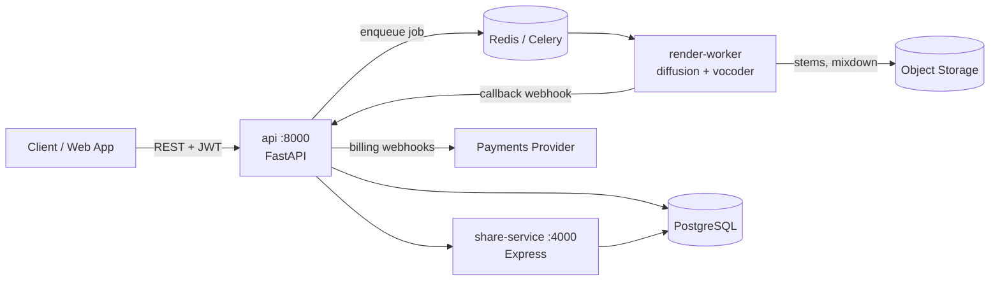

# Suno-Swarm — Generative Music Platform (Reference Implementation)

Suno-Swarm is a reference implementation of a production-shaped **generative music platform**:
users write a text prompt, the platform renders a full song (vocals + instrumental stems),
stores the artifacts in object storage, and exposes them through a social/sharing layer.

The repository is intentionally structured like a real multi-service product so that it can be
used for architecture reviews, onboarding walkthroughs, and automated code-analysis demos.



## Services

| Service | Path | Runtime | Responsibility |
| --- | --- | --- | --- |
| `api` | [`services/api`](services/api) | Python 3.11 / FastAPI | Auth, users, prompts, track CRUD, playlists, admin, billing webhooks |
| `render-worker` | [`services/render-worker`](services/render-worker) | Python 3.11 / Celery | Prompt conditioning, model inference, stem separation, audio transcode |
| `share-service` | [`services/share-service`](services/share-service) | Node 20 / Express | Public share pages, embeds, OG cards, short links |
| `web` | [`web`](web) | Vite + React | Studio UI: prompt composer, waveform player, library |

## Core domain concepts

- **Prompt** — the natural-language description plus structured controls (genre, bpm, key, duration).
- **RenderJob** — a queued unit of work; transitions `queued → conditioning → rendering → mastering → complete|failed`.
- **Track** — an immutable rendered result (mixdown + stems + metadata + model provenance).
- **Stem** — a single separated source (`vocals`, `drums`, `bass`, `other`) belonging to a track.
- **Playlist** — an ordered, shareable collection of tracks.
- **Credit ledger** — per-workspace metering; every render debits credits, billing webhooks top them up.

See [`docs/ARCHITECTURE.md`](docs/ARCHITECTURE.md) for the request/render lifecycle,
[`docs/DATA_MODEL.md`](docs/DATA_MODEL.md) for the schema, and
[`docs/API.md`](docs/API.md) for the endpoint reference.

## Quick start

```bash
cp .env.example .env
docker compose -f infra/docker/docker-compose.yml up --build
# api:            http://localhost:8000/docs
# share-service:  http://localhost:4000
# web:            http://localhost:5173
```

Local development without Docker:

```bash
cd services/api && pip install -r requirements.txt && uvicorn app.main:app --reload
cd services/render-worker && pip install -r requirements.txt && celery -A worker.tasks worker -l info
cd services/share-service && npm install && npm start
cd web && npm install && npm run dev
```

## Repository layout

```
services/api/app
  main.py            app factory, middleware, router wiring
  core/              config, security primitives, database session
  models/            SQLAlchemy models + Pydantic schemas
  routers/           auth, users, prompts, tracks, playlists, admin, webhooks
  services/          storage, queue, audio, moderation adapters
services/render-worker/worker
  tasks.py           Celery entrypoints
  pipeline.py        conditioning → inference → mastering
  audio.py           transcode / stem packaging helpers
services/share-service/src
  server.js          public share + embed routes
infra/
  docker/            Dockerfiles + compose stack
  k8s/               Deployments, Services, Ingress
  terraform/         S3 buckets, IAM, RDS
docs/                architecture, API, data model, ops runbooks
```

## Documentation index

- [Architecture](docs/ARCHITECTURE.md)
- [Generation pipeline](docs/GENERATION_PIPELINE.md)
- [API reference](docs/API.md)
- [Data model](docs/DATA_MODEL.md)
- [Security model](docs/SECURITY.md)
- [Deployment & operations](docs/DEPLOYMENT.md)
- [Contributing](CONTRIBUTING.md)

## Status

This is a demo/reference codebase. It is **not** production hardened — see
[`docs/SECURITY.md`](docs/SECURITY.md) for the known gaps in the current implementation.
