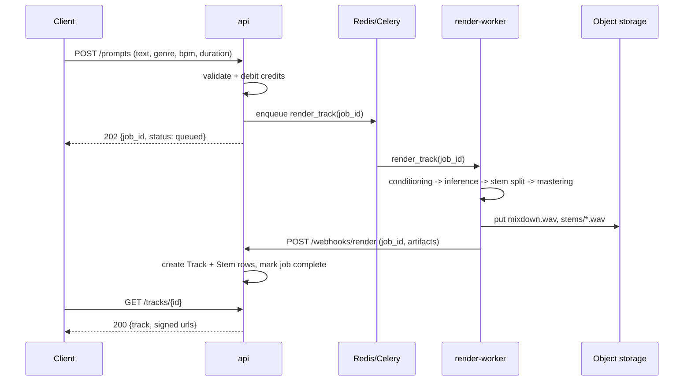

# Architecture

## Overview

Suno-Swarm is split into four deployables plus three stateful dependencies. The `api` service is
the only component that talks to PostgreSQL directly; everything else reaches state through the
API or through object storage.



## Component responsibilities

### api (`services/api`)
- Terminates client traffic, issues and validates JWT access tokens.
- Owns the write path for `users`, `workspaces`, `prompts`, `render_jobs`, `tracks`, `playlists`.
- Publishes render jobs onto Celery and consumes worker callbacks on `/webhooks/render`.
- Consumes payment provider webhooks on `/webhooks/billing` to credit workspaces.
- Exposes `/admin/*` operational endpoints (job requeue, user lookup, feature flags).

### render-worker (`services/render-worker`)
- Pulls jobs from Redis. Each job is CPU/GPU bound and runs in a dedicated process.
- `pipeline.py` implements four stages:
  1. **conditioning** — tokenize the prompt, resolve style embeddings, optionally load a
     user-supplied reference audio clip for melody conditioning.
  2. **inference** — run the latent diffusion transformer, then the vocoder.
  3. **separation** — split the mixdown into four stems.
  4. **mastering** — loudness normalize and transcode to `mp3`/`flac` via `ffmpeg`.
- Writes artifacts to object storage, then calls back into the API.

### share-service (`services/share-service`)
- Server-renders public pages for shared tracks and playlists (`/s/:slug`), OG/Twitter cards,
  and `<iframe>` embeds. Read-only against the database.

### web (`web`)
- Vite + React studio UI. Prompt composer, job progress, waveform player, library and
  playlist management. Talks only to `api` and `share-service`.

## Cross-cutting concerns

| Concern | Where it lives |
| --- | --- |
| Configuration | `services/api/app/core/config.py` (env + `config/*.yaml` overlay) |
| AuthN | `services/api/app/core/security.py` (password hashing, JWT encode/decode) |
| AuthZ | Per-router dependencies (`current_user`, `require_admin`) |
| Storage | `services/api/app/services/storage.py`, worker uses the same key layout |
| Queueing | `services/api/app/services/queue.py` → Celery/Redis |
| Moderation | `services/api/app/services/moderation.py` (prompt blocklist + lyric scan) |
| Observability | structured logs to stdout, `/healthz` and `/metrics` on every service |

## Storage key layout

```
s3://suno-swarm-artifacts/
  workspaces/{workspace_id}/tracks/{track_id}/mixdown.wav
  workspaces/{workspace_id}/tracks/{track_id}/mixdown.mp3
  workspaces/{workspace_id}/tracks/{track_id}/stems/{vocals|drums|bass|other}.wav
  workspaces/{workspace_id}/uploads/{upload_id}/{filename}
  samplepacks/{pack_id}.zip
```

## Failure handling

- Render jobs retry three times with exponential backoff; the fourth failure marks the job
  `failed` and refunds credits.
- Worker callbacks are idempotent on `job_id`.
- The API degrades to read-only if Redis is unavailable (renders rejected with `503`).
