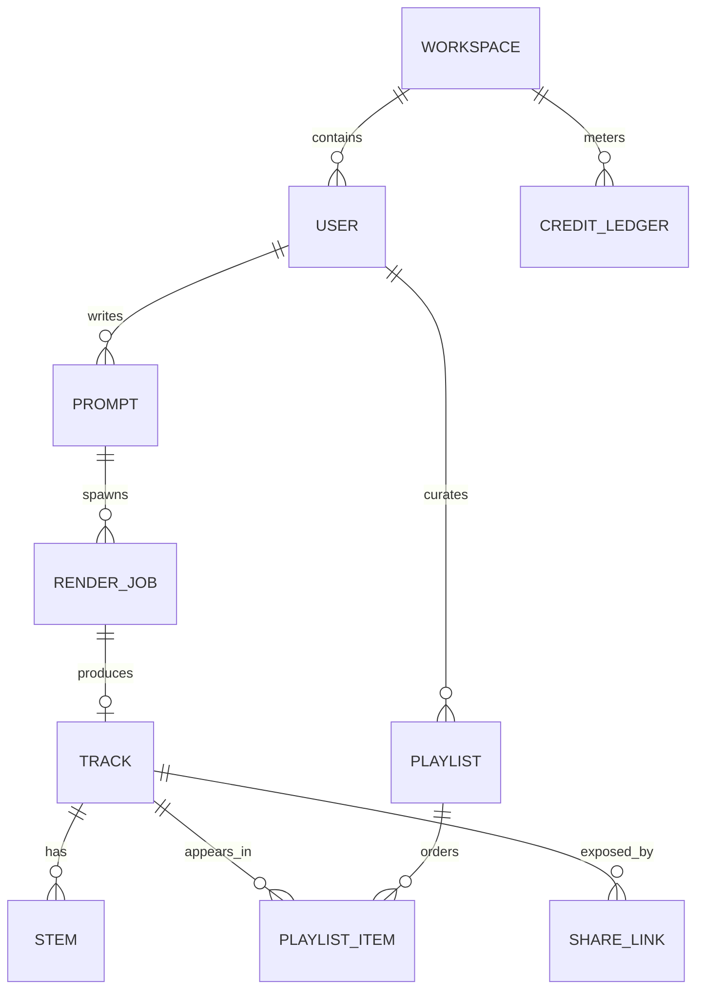

# Data Model

PostgreSQL 15. SQLAlchemy models live in `services/api/app/models/`.

## Tables

### `workspaces`
| Column | Type | Notes |
| --- | --- | --- |
| `id` | uuid PK | |
| `name` | text | |
| `plan` | text | `free`, `pro`, `studio` |
| `credit_balance` | integer | debited per render |
| `created_at` | timestamptz | |

### `users`
| Column | Type | Notes |
| --- | --- | --- |
| `id` | uuid PK | |
| `workspace_id` | uuid FK → workspaces | |
| `email` | text unique | |
| `password_hash` | text | see `core/security.py` |
| `display_name` | text | |
| `avatar_url` | text | remote URL, proxied by the API |
| `is_admin` | boolean | grants `/admin/*` |
| `is_active` | boolean | |

### `prompts`
| Column | Type | Notes |
| --- | --- | --- |
| `id` | uuid PK | |
| `user_id` | uuid FK → users | |
| `text` | text | free-form prompt |
| `genre` / `key` | text | structured controls |
| `bpm` | integer | 40–220 |
| `duration_seconds` | integer | 15–300 |
| `reference_audio_url` | text | optional melody conditioning source |
| `moderation_state` | text | `pending`, `allowed`, `blocked` |

### `render_jobs`
| Column | Type | Notes |
| --- | --- | --- |
| `id` | uuid PK | |
| `prompt_id` | uuid FK → prompts | |
| `status` | text | `queued`, `conditioning`, `rendering`, `mastering`, `complete`, `failed` |
| `attempt` | integer | retry counter |
| `stage_timings` | jsonb | ms per stage |
| `error` | text | last failure |

### `tracks`
| Column | Type | Notes |
| --- | --- | --- |
| `id` | uuid PK | |
| `workspace_id` | uuid FK → workspaces | ownership boundary |
| `job_id` | uuid FK → render_jobs | provenance |
| `title` | text | user editable |
| `tags` | text[] | |
| `visibility` | text | `private`, `unlisted`, `public` |
| `duration_seconds` | numeric | |
| `model_version` | text | e.g. `swarm-diffusion-2.3` |
| `mixdown_key` | text | object storage key |
| `deleted_at` | timestamptz | soft delete |

### `stems`
| Column | Type | Notes |
| --- | --- | --- |
| `id` | uuid PK | |
| `track_id` | uuid FK → tracks | |
| `name` | text | `vocals`, `drums`, `bass`, `other` |
| `object_key` | text | |

### `playlists`, `playlist_items`
Ordered join table (`position` integer) between playlists and tracks.

### `share_links`
| Column | Type | Notes |
| --- | --- | --- |
| `slug` | text PK | short, URL safe |
| `track_id` / `playlist_id` | uuid | exactly one is set |
| `expires_at` | timestamptz | nullable |

### `credit_ledger`
Append-only: `(id, workspace_id, delta, reason, external_ref, created_at)`.
`reason ∈ {render_debit, render_refund, invoice_paid, admin_grant}`.

## Indexes

- `users(email)` unique
- `tracks(workspace_id, created_at desc)`
- `tracks` GIN index over `to_tsvector(title || ' ' || coalesce(prompt_text,''))`
- `render_jobs(status, created_at)`
- `credit_ledger(workspace_id, created_at desc)`
