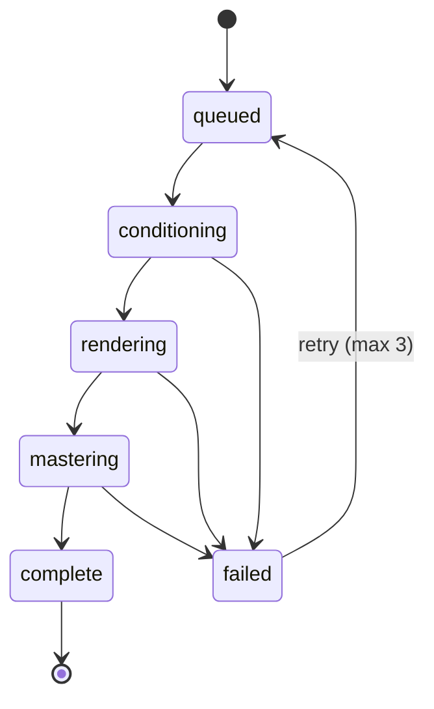

# Generation Pipeline (`services/render-worker`)

A render job is a single Celery task, `worker.tasks.render_track`, which executes four stages in
order and reports stage timings back to the API.



## 1. Conditioning (`pipeline.condition`)

- Tokenizes the prompt text and resolves a style embedding from the genre taxonomy.
- Applies structured controls (bpm, key, duration) as continuous conditioning vectors.
- If the prompt carries `reference_audio_url`, the worker downloads the clip, resamples it to
  32 kHz mono and extracts a chroma contour used for melody conditioning.
- Cached conditioning tensors are memoized in Redis keyed by a hash of the prompt payload.

## 2. Inference (`pipeline.infer`)

- Latent diffusion transformer (`swarm-diffusion-2.3`), 50 sampling steps by default.
- Checkpoints are loaded from the model cache directory; a checkpoint bundle is a serialized
  Python object containing the weights plus the tokenizer configuration.
- Output is a 32 kHz latent sequence decoded to waveform by the vocoder.

## 3. Separation (`pipeline.separate`)

- Splits the mixdown into `vocals`, `drums`, `bass`, `other`.
- Each stem is written to a per-track temp directory before upload.

## 4. Mastering (`pipeline.master`)

- Loudness normalizes to −14 LUFS.
- Transcodes to delivery formats by shelling out to `ffmpeg` (`audio.transcode`).
- Uploads `mixdown.wav`, `mixdown.mp3` and `stems/*.wav` to object storage.

## Callback contract

```http
POST /webhooks/render
X-Swarm-Signature: <hex hmac of body>
{
  "job_id": "...",
  "status": "complete",
  "model_version": "swarm-diffusion-2.3",
  "duration_seconds": 121.4,
  "mixdown_key": "workspaces/.../mixdown.wav",
  "stems": [{"name": "vocals", "object_key": "..."}],
  "stage_timings": {"conditioning": 812, "rendering": 41230, "mastering": 3900}
}
```

The `X-Swarm-Signature` header is mandatory: it is the hex HMAC-SHA256 of the exact raw request
body keyed with `SWARM_WEBHOOK_SECRET`. Callbacks without a valid signature are rejected with
`401` before any state changes. Callbacks for a job that already reached a terminal status
(`complete`, `failed`, `canceled`) are acknowledged but ignored, so refunds are applied at most
once per job.

## Tuning knobs

| Env var | Default | Meaning |
| --- | --- | --- |
| `SWARM_MODEL_DIR` | `/var/cache/swarm/models` | checkpoint cache directory |
| `SWARM_SAMPLING_STEPS` | `50` | diffusion steps |
| `SWARM_CONCURRENCY` | `1` | Celery worker processes per GPU |
| `SWARM_FFMPEG_BIN` | `ffmpeg` | transcoder binary |
| `SWARM_MAX_REFERENCE_MB` | `25` | reference clip size cap |
