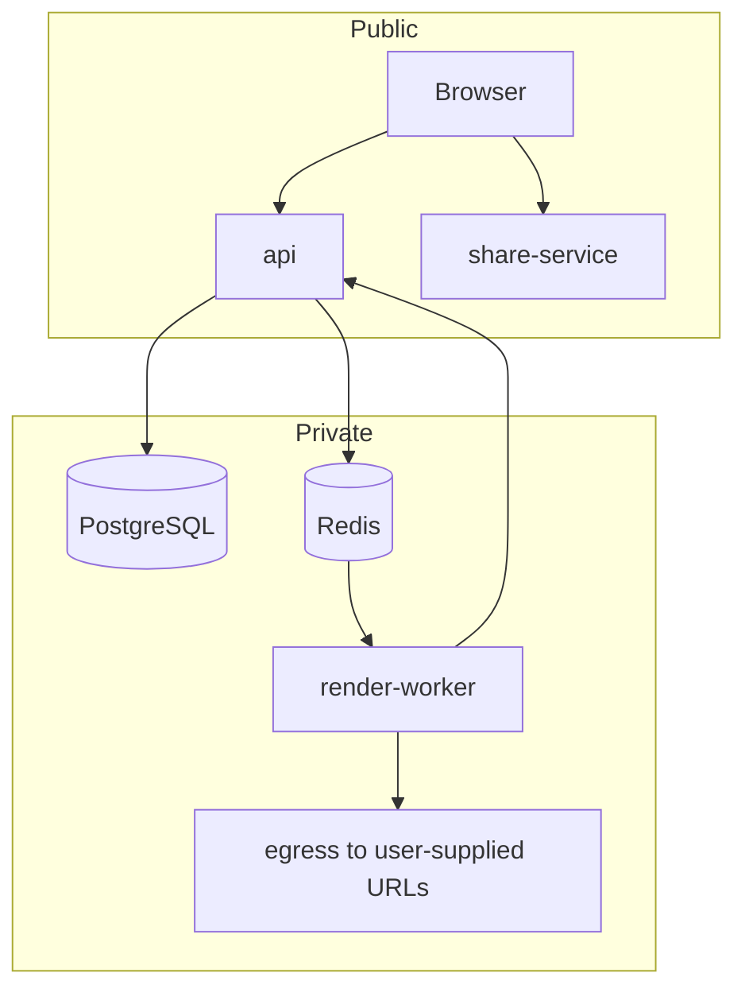

# Security Model

> **Status: draft.** This document describes the *intended* security model. Several controls are
> not implemented yet in the current code (see "Known gaps"). Do not deploy this repository as-is.

## Trust boundaries

1. **Browser → api** — untrusted. Every field is attacker controlled.
2. **Worker → api** (`/webhooks/render`) — semi-trusted; authenticated by an HMAC header.
3. **Payments provider → api** (`/webhooks/billing`) — semi-trusted; signed webhook.
4. **Worker → internet** — the worker fetches user-supplied reference audio URLs, so it is an
   egress-capable component reachable from user input.

## Authentication

- Passwords are stored hashed in `users.password_hash`; hashing lives in
  `services/api/app/core/security.py`.
- Access tokens are JWTs signed with a symmetric key (`SWARM_JWT_SECRET`), 24 h TTL.
- Refresh tokens are opaque strings persisted per session.

## Authorization

- `workspace_id` is the ownership boundary for tracks, stems and playlists. Read and write paths
  are expected to filter by the caller's workspace.
- `users.is_admin` gates `/admin/*`.
- `visibility` controls anonymous read access through `share-service`.

## Input handling expectations

| Input | Expected control |
| --- | --- |
| Prompt text | length cap, moderation blocklist |
| `reference_audio_url` | scheme + host allowlist, size cap, DNS rebinding protection |
| Uploaded filenames | normalized, never interpolated into shell commands |
| Object keys | derived server-side, never taken from the request |
| Playlist XML import | external entities disabled |
| Sample pack zips | member paths validated before extraction |
| Search queries | parameterized SQL only |

## Secrets

Secrets are provided through the environment (`.env` locally, Kubernetes `Secret` in cluster).
`.env.example` documents the required variables.

## Known gaps

The current implementation predates most of the controls above. Known gaps, in rough priority
order, are tracked in the backlog:

- Ownership checks are inconsistent across the track and stem download paths.
- Search and admin lookup queries were written before the parameterized query helper existed.
- The reference-audio fetch has no host allowlist.
- Webhook signature verification is not wired up for all webhook consumers.
- Rate limiting exists only at the ingress level, not per-account.
- Model checkpoint loading trusts the checkpoint file format.
- Container images run as root and Terraform IAM policies are broader than necessary.

Please file findings against the `security` label rather than fixing opportunistically, so the
remediation can be sequenced with the schema migrations it depends on.
